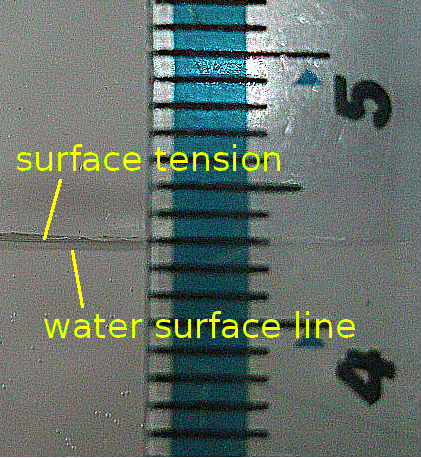
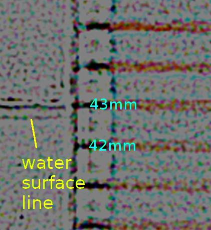

# Fishing Line Experiment

## Theory

The purpose of this experiment is to determine the curvature of the earth solely
by mechanical measurement.

A neutrally buoyant fishing line should form a perfectly straight
line when held under high tension in a long stretch of still water. If
each end is at depth *Y* beneath the water surface *S*
and we measure the depth *Y + dY* at the line's midpoint, then:

* *dY* > 0 implies convexity of *S*
* *dY* < 0 implies concavity of *S*
* *dY* = 0 implies flatness of *S*

## Design considerations

### Achieving neutral buoyancy

* To make a floating line sink, decrease the water density by mixing in ethanol.
* To make a sinking line float, increase the water density by adding salt.

After the water has been calibrated, a change in temperature will cause it's density
to change according to [this table](http://www.csgnetwork.com/waterinformation.html).
In addition, [evaporation of an ethanol solution may cause it's density to change](http://bayblab.blogspot.co.uk/2009/01/evaporation-rates-of-ethanol-solutions.html)
although the effect is probably very small.

### Water currents

Water currents may be caused by convection due to temperature differences, surface
wind and other disturbances.
According to the idealised equations in [flx-calc], the midpoint of a 1.2mm x 226m
line at 1000N would be displaced 0.034mm in a slow prevailing current of 50mm/minute.

### Line material

A line will stretch under tension (as determined by its
[Young's modulus](https://en.wikipedia.org/wiki/Young's_modulus))
causing its density to reduce and its midpoint to rise.
A stretched line will also tend to reduce its diameter (as determined by its
[Poisson ratio](https://en.wikipedia.org/wiki/Poisson's_ratio))
causing its buoyancy to reduce and its midpoint to fall.
The change in length and diameter must be accurately measured so the expected
midpoint displacement can be calculated.
To minimise the midpoint displacement, a line with minimal stretch should be chosen.

Material | density g/cm^3 | Young's modulus GPa | Elongation | Water absorption
---------|----------------|---------------------|------------|------------------
nylon 6 | 1.12 - 1.14 | 2.3 - 2.5 | >15% | high
Dyneema&nbsp;SK60 | 0.97 | [79][ref1] | 3 - 5% | near zero
Dyneema&nbsp;SK71 | 0.97 | [123][ref1] | 3 - 5% | near zero
Spectra&nbsp;A | 0.97 | [120][ref2] | 3.5% | near zero
Spectra&nbsp;B | 0.97 | [170][ref2] | 2.7% | near zero
[ref1]: http://www.toyobo-global.com/seihin/dn/dyneema/seihin/
[ref2]: http://www.goodfellow.com/E/Polyethylene-UHMW.html

### Line smoothness

A line with a smooth round exterior, such as nylon monofilament
and small diameter dyneema lines like
[Berkley NanoFil unifilament](http://www.berkley-fishing.com/berkley-line-uni-filament-berkley-nanofil/berkley-nanofil/1285551.html),
will be easier to measure against (both visually and with a micrometer)
and less susceptible to water currents.

### Depth measurement

A quick proof of concept with a cheap Samsung NV30 digicam and a standard domestic ruler
demonstrates reading precision to about +/- 0.25mm:

Greater precision should be possible with a microscope, and
there are a number of high precision rulers available:

Ruler length | Graduations (mm) | URL
-------------|------------------|:---
6"   | 0.254 | http://www.geionline.com/rulers/general-purpose-inch-metric/2014a
10mm | 0.10  | http://www.tedpella.com/tools_html/Micro-Tool-Measurement.htm
50mm | 0.10  | https://www.pepleroptics.com/length-measuring/glass-measuring-ruler-peak-1972-series.html
6"   | 0.10  | http://www.maxlevy.com/product/EA018.html
6"   | 0.05  | http://www.maxlevy.com/product/EA017.html
6"   | 0.025 | http://www.maxlevy.com/product/EA016.html

Parallax could be a major source of error.

[flx-calc]: http://dizzib.github.io/earth/flx-calc/index.html
